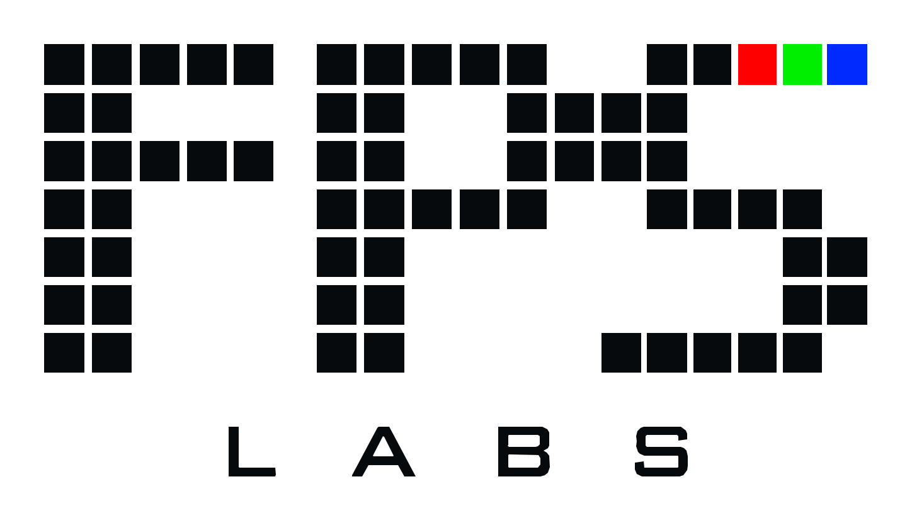

<picture>
  <source media="(prefers-color-scheme: dark)" srcset="assets/fps-labs-logo-on-dark.svg">
  <source media="(prefers-color-scheme: light)" srcset="assets/fps-labs-logo-on-light.svg">
  
</picture>

# Turning movement into meaning.

The highlight you want to watch again. The race photo you want to keep. The game you want to understand.

We capture sport frame by frame, find the person, frame the moment, deliver it and analyse it. Our own engineers build the computer vision behind it, in-house.

**FPS means Frames Per Second.** One lab. Different applications.

[Explore the lab](https://fpslabs.ai) · [Talk to us](mailto:support@fpslabs.ai)

---

## 01 / BAM · Padel

### Every player's game seen, shared and celebrated.

Full games and highlights, live streaming for friends and fans, VAR replay, leagues, round robins, matchmaking and club leaderboards.

**Analytics: coming soon.** Heat maps, shot types and errors.

Visit [fpslabs.ai](https://fpslabs.ai) for current product information and the BAM web app.

## 02 / SnapRun · Race photos

### Cross the line. The photo is already yours.

**Coming soon · working name.**

Race-day capture for marathons. Cameras along the course photograph runners, with the goal of delivering their pictures before the medal does.

---

## The lab

We bring technology, movement and community together. FPS Labs is the company and the technology behind the products.

This GitHub profile introduces the lab. Public documentation and product updates will be shared as they become available.

**Talk to the lab.**  
[Website](https://fpslabs.ai) · [Email](mailto:support@fpslabs.ai) · [Instagram](https://www.instagram.com/fpslabs.ai)

*Making amateurs feel like professionals.*
